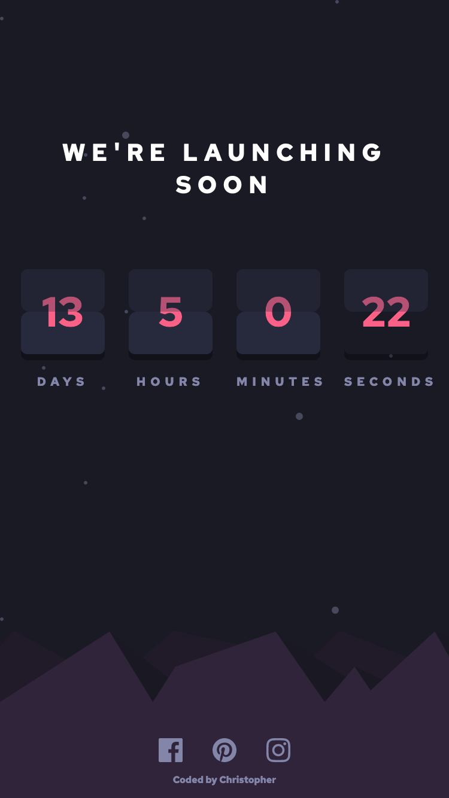

# Frontend Mentor - Launch countdown timer solution

This is a solution to the [Launch countdown timer challenge on Frontend Mentor](https://www.frontendmentor.io/challenges/launch-countdown-timer-N0XkGfyz-). Frontend Mentor challenges help you improve your coding skills by building realistic projects. 

## Table of contents

- [Overview](#overview)
  - [The challenge](#the-challenge)
  - [Screenshot](#screenshot)
  - [Links](#links)
  - [Built with](#built-with)
- [Author](#author)

**Note: Delete this note and update the table of contents based on what sections you keep.**

## Overview

### The challenge

Users should be able to:

- See hover states for all interactive elements on the page
- See a live countdown timer that ticks down every second (start the count at 14 days)
- **Bonus**: When a number changes, make the card flip from the middle

### Screenshot

### Links

- Solution URL: [GitHub Repo](https://github.com/donchriscorleone/launch-countdown-timer-solution)
- Live Site URL: [Live Site](https://donchriscorleone.github.io/launch-countdown-timer-solution/)

### Built with

- Semantic HTML5 markup
- CSS custom properties
- Flexbox
- CSS Grid
- Mobile-first workflow
- Vanilla JavaScript

## Author

- LinkedIn - [@christopheriilajom](https://www.linkedin.com/in/christopher-ii-lajom-031959211/)
- Frontend Mentor - [@donchriscorleone](https://www.frontendmentor.io/profile/donchriscorleone)
- Instagram - [@christopheriilajom](https://www.instagram.com/christopheriilajom)
- GitHub - [@donchriscorleone](https://www.github.com/donchriscorleone)

